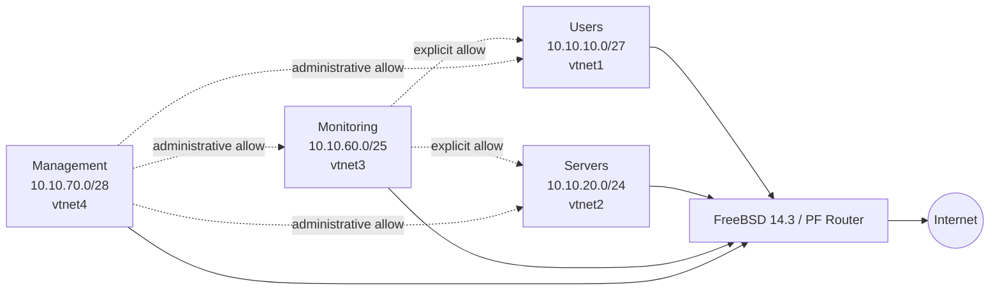

# Cybersecurity Private Cloud Homelab

> Evidence-oriented design for a segmented private-cloud security lab and its
> synthetic detection-engineering scenarios.

- Architecture: [federated design](docs/adr/ADR-001-federated-architecture.md)
- Security model: [default-deny policy specification](docs/governance/firewall-policy.md)
- Governance: [BSI and ISO/IEC control mapping](docs/governance/bsi-iso-mapping.md)

---

## Executive Summary

This repository contains the architectural definition, declarative
infrastructure-as-code (IaC), governance policies, detection artifacts and
evidence specifications for the **Cybersecurity Private Cloud Homelab**.

The design applies defense-in-depth and Zero Trust principles to four
segmented L2/L3 security zones. Terraform resources and detection rules are
**configured** and syntax-validated where the required tooling is available.

Firewall enforcement is evidenced at two distinct levels:

1. an isolated nftables reference harness validates deterministic policy
   behavior with synthetic four-zone traffic; and
2. a native FreeBSD PF router running in a local UTM lab validates observed
   routing, NAT, inter-zone allow/deny behavior, management access and
   controlled reboot persistence.

These results do not prove pfSense or Proxmox deployment, production readiness,
formal compliance or continuous operating control effectiveness. The repository
is intended to host federated workloads, including the
**[Bonfim AI Platform](https://github.com/a-bonfim-tech/bonfim-ai-platform)**.

## Evidence Status

| Capability | Current state | Evidence boundary |
| :--- | :--- | :--- |
| Network segmentation | NATIVE_PF_AND_REFERENCE_HARNESS_TESTED | Native FreeBSD PF execution validates routing, NAT, inter-zone allow/deny behavior and controlled reboot persistence; the nftables harness remains complementary reference-policy evidence. pfSense and Proxmox deployment remain unproven. |
| Peer-trusted guest network | PERSISTENCE_TESTED | The synthetic VLAN 10 guest retained `10.10.10.10/24`, no default route and no DNS across a controlled reboot; this is not pfSense or inter-zone enforcement evidence. |
| Proxmox infrastructure | CONFIGURED | Terraform is present; no `terraform apply` evidence is claimed. |
| Suricata reconnaissance detection | TESTED | Suricata 8.0.6 emitted one alert for the positive PCAP and zero for two bounded negative controls. |
| Wazuh correlation | TESTED | Wazuh 4.14.7 `wazuh-logtest` matched rule 100010 and passed two bounded negative controls; manager operation is unproven. |
| BSI / ISO/IEC alignment | MAPPED | Mapping is not certification or formal compliance. |

- `COMPLIANCE_CERTIFIED=false`
- `EXTERNAL_AUDIT_PERFORMED=false`

---

## Validated Lab Topology

The diagram represents the bounded paths exercised in the retained native PF lab evidence.
It is not a claim of unrestricted bidirectional trust or production control effectiveness.

---

## Validated Security Zones

| Zone | CIDR | Router interface | Validated policy role |
| :--- | :--- | :--- | :--- |
| Users | `10.10.10.0/27` | `vtnet1` | Default-denied from Servers; reachable from Monitoring and Management where explicitly allowed |
| Servers | `10.10.20.0/24` | `vtnet2` | Protected workload segment; Monitoring and Management paths validated |
| Monitoring | `10.10.60.0/25` | `vtnet3` | May reach Users and Servers; denied from Management segment |
| Management | `10.10.70.0/28` | `vtnet4` | Administrative segment with validated SSH access to the router and access to internal segments |

Observed native PF evidence is retained under
[`docs/evidence/executions/freebsd-pf-segmentation/`](docs/evidence/executions/freebsd-pf-segmentation/).
The validated matrix is evidence for this bounded lab topology and should not be
interpreted as certification or continuous production effectiveness.

---

## Key Artifacts & Portfolio Proofs

* **Architecture & ADRs:** [`ADR-001`](docs/adr/ADR-001-federated-architecture.md) & [`trust-boundaries.md`](docs/architecture/trust-boundaries.md)
* **Federated Integration:** [`federated-integration.md`](docs/architecture/federated-integration.md)
* **Governance & Framework Mapping:** [`bsi-iso-mapping.md`](docs/governance/bsi-iso-mapping.md) & [`firewall-policy.md`](docs/governance/firewall-policy.md)
* **Detection Engineering:** [`local.rules`](detections/suricata/local.rules) & [`local_rules.xml`](detections/wazuh/local_rules.xml)
* **Threat Modeling & Graphs:** [`server-ingress-attack-graph.json`](attack-graphs/server-ingress-attack-graph.json) & [`threat-model.md`](docs/threat-model/threat-model.md)
* **Purple-Team Runbook:** [`RUNBOOK-001`](docs/evidence/purple-team-runs/RUNBOOK-001-recon-and-pivoting.md)
* **Evidence Manifest:** [`evidence-manifest.json`](docs/evidence/evidence-manifest.json)
* **Reference Firewall Harness:** [`tools/firewall-lab`](tools/firewall-lab) & [executed nftables evidence](docs/evidence/executions/firewall/README.md)
* **Native FreeBSD PF Segmentation:** [executed evidence](docs/evidence/executions/freebsd-pf-segmentation/README.md) & [`FBSD-PF-SEG-EXEC-001`](docs/evidence/executions/freebsd-pf-segmentation/FBSD-PF-SEG-EXEC-001-summary.json)
* **Peer-Trusted Network Gate:** [`RUNBOOK-002`](docs/evidence/purple-team-runs/RUNBOOK-002-peer-trusted-network-persistence.md) & [executed evidence](docs/evidence/executions/peer-trusted-network/README.md)
* **Infrastructure-as-Code:** [`main.tf`](iac/terraform/main.tf)

---

## License

This project is licensed under the MIT License - see the [LICENSE](LICENSE) file for details.
