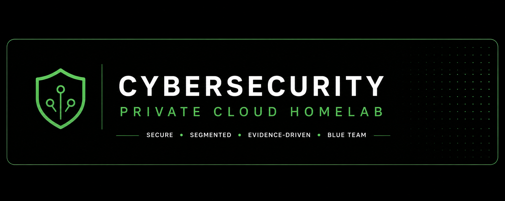
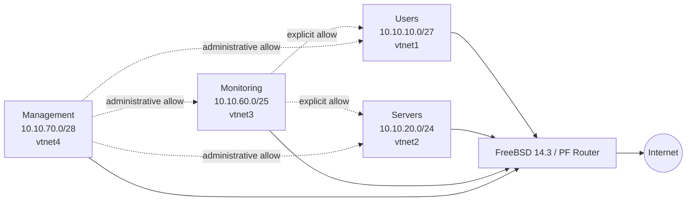

# Cybersecurity Private Cloud Homelab



[](https://github.com/a-bonfim-tech/cybersecurity-private-cloud-homelab/actions/workflows/lint-and-validate.yml)
[](docs/evidence/evidence-manifest.json)
[](LICENSE)


> Evidence-oriented design for a segmented private-cloud security lab and its
> synthetic detection-engineering scenarios.

- Architecture: [federated design](docs/adr/ADR-001-federated-architecture.md)
- Recruiter overview: [2–5 minute technical brief](docs/recruiter-brief.md)
- Current security model: [native PF segmentation policy](docs/governance/current-segmentation-policy.md)
- Reference security model: [synthetic nftables policy](docs/governance/firewall-policy.md)
- Governance: [BSI and ISO/IEC control mapping](docs/governance/bsi-iso-mapping.md)

---

## Executive Summary

This repository contains the architectural definition, declarative
infrastructure-as-code (IaC), governance policies, detection artifacts and
evidence specifications for the **Cybersecurity Private Cloud Homelab**.

The design applies defense-in-depth and Zero Trust principles to four
segmented L2/L3 security zones. Terraform resources and detection rules are
**configured** and syntax-validated where the required tooling is available.

Firewall enforcement is evidenced at two distinct levels:

1. an isolated nftables reference harness validates deterministic policy
   behavior with synthetic four-zone traffic; and
2. a native FreeBSD PF router running in a local UTM lab validates observed
   routing, NAT, inter-zone allow/deny behavior, management access and
   controlled reboot persistence.

These results do not prove pfSense or Proxmox deployment, production readiness,
formal compliance or continuous operating control effectiveness. The repository
is intended to host federated workloads, including the
**[Bonfim AI Platform](https://github.com/a-bonfim-tech/bonfim-ai-platform)**.

## What This Repository Proves

### Proven by retained evidence

- Native FreeBSD PF segmentation and routing in the local UTM lab
- Inter-zone allow and deny behavior for the validated test matrix
- NAT from all four validated internal networks
- PF, IPv4 forwarding and management access persistence after controlled reboot
- Suricata positive and bounded negative detection tests
- Wazuh native rule evaluation with bounded negative controls
- Evidence integrity through manifests, SHA-256 hashes and automated validation

### Not proven

- pfSense execution
- Proxmox deployment or terraform apply
- Continuous operating control effectiveness
- Compliance certification
- External audit
- A unified PF-to-Suricata-to-Wazuh operational packet path

---

## Evidence Status

| Capability | Current state | Evidence boundary |
| :--- | :--- | :--- |
| Network segmentation | NATIVE_PF_AND_REFERENCE_HARNESS_TESTED | Native FreeBSD PF execution validates routing, NAT, inter-zone allow/deny behavior and controlled reboot persistence; the nftables harness remains complementary reference-policy evidence. pfSense and Proxmox deployment remain unproven. |
| Peer-trusted guest network | HISTORICAL_PERSISTENCE_EVIDENCE | The retained historical guest package includes both `/27` and `/24` address states across its correction procedure. It remains bounded guest-configuration evidence and is not authoritative for the current topology. |
| Proxmox infrastructure | CONFIGURED | Terraform is present; no `terraform apply` evidence is claimed. |
| Suricata reconnaissance detection | TESTED | Suricata 8.0.6 emitted one alert for the positive PCAP and zero for two bounded negative controls. |
| Wazuh correlation | TESTED | Wazuh 4.14.7 `wazuh-logtest` matched rule 100010 and passed two bounded negative controls; manager operation is unproven. |
| BSI / ISO/IEC alignment | MAPPED | Mapping is not certification or formal compliance. |

- `COMPLIANCE_CERTIFIED=false`
- `EXTERNAL_AUDIT_PERFORMED=false`

---

## Topology Classification

The repository retains two intentionally distinct network models:

- **`CURRENT_NATIVE_PF_TOPOLOGY`** — `10.10.10.0/27`, `10.10.20.0/24`, `10.10.60.0/25`, `10.10.70.0/28`; authoritative for the current native PF lab and target IaC.
- **`REFERENCE_SYNTHETIC_TOPOLOGY`** — historical `10.10.10.0/24`, `10.10.20.0/24`, `10.10.30.0/24`, `10.10.40.0/24`; retained for the nftables, Suricata and Wazuh synthetic evidence.

Historical execution artifacts are not rewritten to simulate execution under
the current topology. See
[`ADR-002`](docs/adr/ADR-002-topology-reconciliation.md).

---

## Validated Lab Topology



The diagram represents the bounded paths exercised in the retained native PF lab evidence.
It is not a claim of unrestricted bidirectional trust or production control effectiveness.

---

## Validated Security Zones

| Zone | CIDR | Router interface | Validated policy role |
| :--- | :--- | :--- | :--- |
| Users | `10.10.10.0/27` | `vtnet1` | Default-denied from Servers; reachable from Monitoring and Management where explicitly allowed |
| Servers | `10.10.20.0/24` | `vtnet2` | Protected workload segment; Monitoring and Management paths validated |
| Monitoring | `10.10.60.0/25` | `vtnet3` | May reach Users and Servers; denied from Management segment |
| Management | `10.10.70.0/28` | `vtnet4` | Administrative segment with validated SSH access to the router and access to internal segments |

Observed native PF evidence is retained under
[`docs/evidence/executions/freebsd-pf-segmentation/`](docs/evidence/executions/freebsd-pf-segmentation/).
The validated matrix is evidence for this bounded lab topology and should not be
interpreted as certification or continuous production effectiveness.

---

## Key Artifacts & Portfolio Proofs

* **Architecture & ADRs:** [`ADR-001`](docs/adr/ADR-001-federated-architecture.md) & [`trust-boundaries.md`](docs/architecture/trust-boundaries.md)
* **Federated Integration:** [`federated-integration.md`](docs/architecture/federated-integration.md)
* **Governance & Framework Mapping:** [`bsi-iso-mapping.md`](docs/governance/bsi-iso-mapping.md) & [`firewall-policy.md`](docs/governance/firewall-policy.md)
* **Detection Engineering:** [`local.rules`](detections/suricata/local.rules) & [`local_rules.xml`](detections/wazuh/local_rules.xml)
* **Threat Modeling & Graphs:** [`server-ingress-attack-graph.json`](attack-graphs/server-ingress-attack-graph.json) & [`threat-model.md`](docs/threat-model/threat-model.md)
* **Purple-Team Runbook:** [`RUNBOOK-001`](docs/evidence/purple-team-runs/RUNBOOK-001-recon-and-pivoting.md)
* **Evidence Manifest:** [`evidence-manifest.json`](docs/evidence/evidence-manifest.json)
* **Reference Firewall Harness:** [`tools/firewall-lab`](tools/firewall-lab) & [executed nftables evidence](docs/evidence/executions/firewall/README.md)
* **Native FreeBSD PF Segmentation:** [executed evidence](docs/evidence/executions/freebsd-pf-segmentation/README.md) & [`FBSD-PF-SEG-EXEC-001`](docs/evidence/executions/freebsd-pf-segmentation/FBSD-PF-SEG-EXEC-001-summary.json)
* **Peer-Trusted Network Gate:** [`RUNBOOK-002`](docs/evidence/purple-team-runs/RUNBOOK-002-peer-trusted-network-persistence.md) & [executed evidence](docs/evidence/executions/peer-trusted-network/README.md)
* **Infrastructure-as-Code:** [`main.tf`](iac/terraform/main.tf)
* **macOS Security Research:** [camera-attribution module](research/macos-camera-attribution/README.md), including frozen protocols, same-host replication, failed-condition evidence and explicit scientific claim limits

---

## Detection and Validation Pipeline

```text
synthetic PCAP -> Suricata rule -> retained EVE alert -> Wazuh rule test
       |                |                   |                 |
 negative controls   offline replay      SHA-256 lineage   native logtest
```

The stages are deliberately separable. The retained evidence proves bounded
offline rule behavior; it does not prove a continuously operating sensor,
manager ingestion, alert persistence or a unified live packet path.

Repository validation covers Terraform formatting and syntax, JSON and XML,
deterministic PCAP generation, evidence-manifest integrity, Suricata positive
and negative controls, Wazuh rule evaluation, shell syntax and the macOS
research unit suite. The camera module currently has 61 local unit tests; its
raw workstation evidence remains private and excluded from Git.

## Research Findings and Reproducibility

- QuickTime preview provider activity is repeatable on one host under the
  frozen A1/B/A2 method.
- Cross-host reproducibility is `NOT_TESTED`; the frozen second-host protocol
  and isolated-worktree runner are provided for an independent Mac.
- The v1 client-discrimination execution is invalid for condition contrast.
- Ten historical v2 attempts are operational abort evidence. Execution
  `20260820T045446Z` established a valid idle/QuickTime/Photo Booth provider
  contrast and is classified `PROVIDER_ONLY`; no direct client discriminator
  was observed.
- Provider stream-related activity is not direct frame-delivery evidence.

See the [experiment register](research/macos-camera-attribution/docs/experiment-register.md),
[replication conclusion](research/macos-camera-attribution/replication/docs/conclusion.md)
and [limitations](research/macos-camera-attribution/docs/limitations.md).

## Repository Map

| Path | Purpose |
| :--- | :--- |
| `docs/architecture`, `docs/adr` | Trust boundaries, topology and decisions |
| `iac/terraform` | Configuration-only Proxmox/pfSense target IaC |
| `detections` | Suricata and Wazuh detection content |
| `tools` | Deterministic validation and isolated firewall harnesses |
| `docs/evidence` | Minimized retained execution evidence and lineage |
| `research/macos-camera-attribution` | Versioned macOS experiment, replication and validation artifacts |

## Skills Demonstrated

Security architecture, network segmentation, detection engineering, threat
modeling, evidence lineage, infrastructure as code, negative-control testing,
privacy-aware acquisition, scientific versioning, failure retention and
claim calibration.

## Known Limitations

- No Proxmox or pfSense execution is retained.
- No continuously operating PF-to-Suricata-to-Wazuh pipeline is evidenced.
- Detection coverage is bounded to the documented synthetic scenarios.
- Camera observations are provider-level; client discrimination, frame
  delivery and cross-host reproducibility are not established.
- CI tooling obtained from the hosted Ubuntu package repositories is mutable
  upstream dependency state and should not be treated as hermetic provenance.

---

## License

This project is licensed under the MIT License - see the [LICENSE](LICENSE) file for details.
